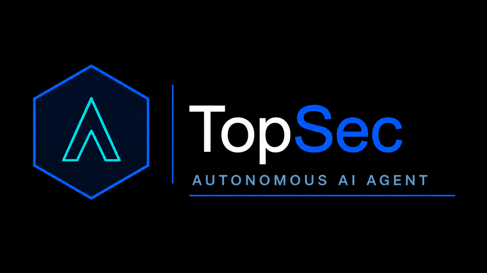
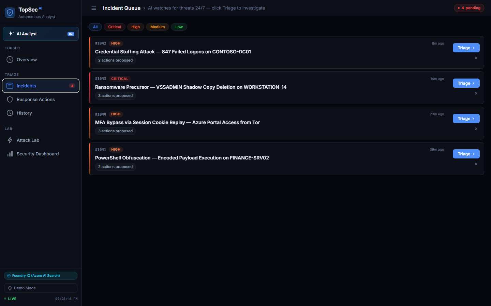
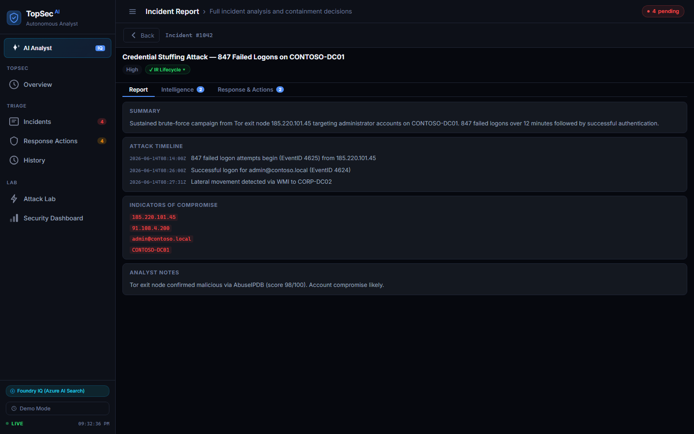
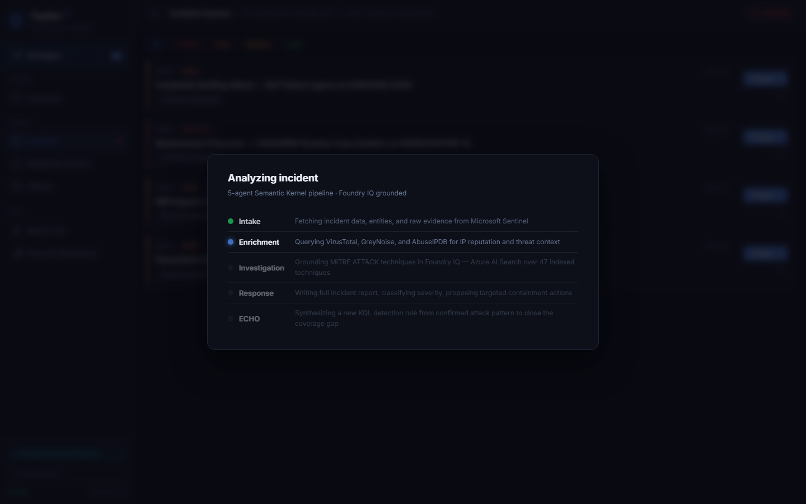
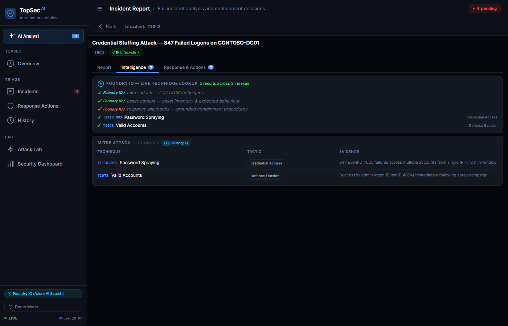
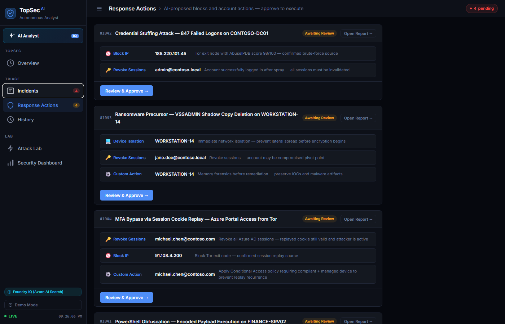
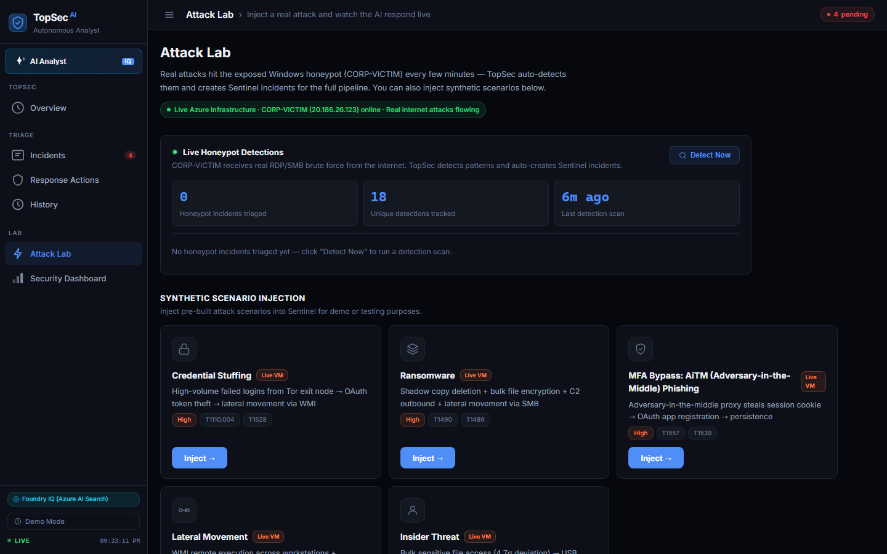
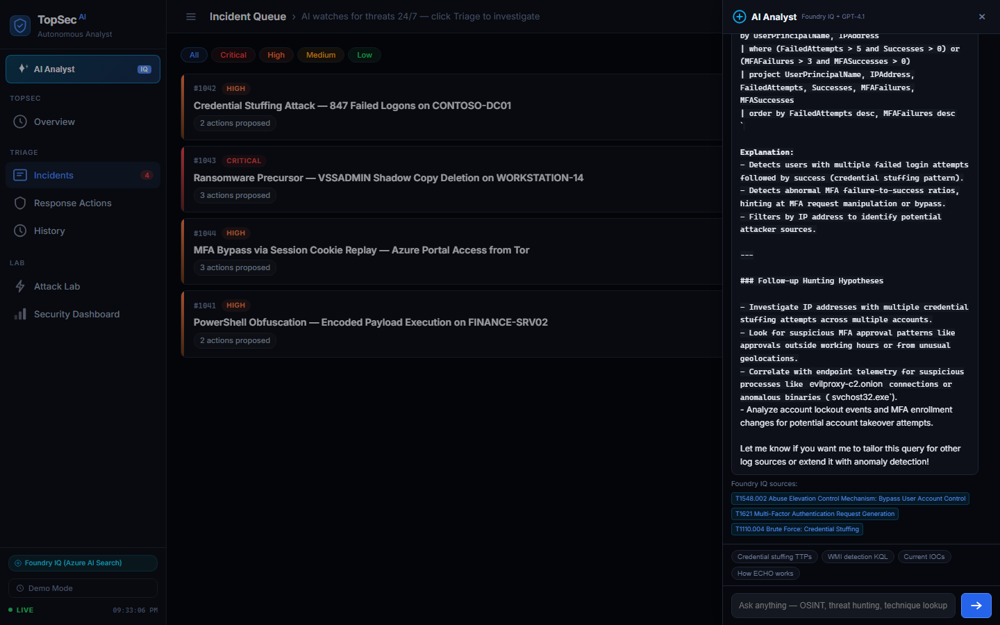

# TopSec Agent



https://github.com/deen-02/TopSec-MS/raw/main/docs/topsec_demo.mp4


Autonomous Tier-1 SOC analyst. A 5-agent AI pipeline that triages Microsoft Sentinel incidents, maps attacks to MITRE ATT&CK via Azure AI Search (Foundry IQ), and synthesizes new KQL detection rules to close coverage gaps.

Built for the **Microsoft Agents League Hackathon 2026, Reasoning Agents track**.

---

## How It Works

A Sentinel alert fires. TopSec Agent runs five agents in sequence, each grounded in structured Pydantic output from the one before it.

| Agent | What it does |
|---|---|
| Intake | Pulls incident details, entities, and raw KQL event logs from Sentinel |
| Enrichment | Queries VirusTotal, AbuseIPDB, and Entra ID for IP and account reputation |
| Investigation | Maps MITRE ATT&CK techniques using Foundry IQ (Azure AI Search, 47 indexed techniques) |
| Response | Writes the full incident report, classifies severity, and proposes targeted containment actions |
| ECHO | Synthesizes a new KQL detection rule from the confirmed attack pattern |

Every ATT&CK technique is grounded in retrieval from Azure AI Search across three knowledge indexes. A human analyst reviews and approves all proposed actions before execution.

---

## Quick Start

No Azure credentials needed. Runs entirely from a pre-built scenario.

```bash
git clone https://github.com/deen-02/TopSec-MS
cd TopSec-MS
```

**Windows**
```powershell
py -m pip install -r requirements.txt
py demo.py
```

**Mac / Linux**
```bash
pip3 install -r requirements.txt
python3 demo.py
```

Opens `http://localhost:8000` automatically.

---

## Screenshots

### Incident Queue
Four concurrent threats, each showing severity, type, and action count.



### Incident Report (Intake Agent)
Structured summary, timestamped attack timeline, and extracted IOCs ready for analyst review.



### Pipeline Running (Orchestrator)
Intake complete, Enrichment running, Investigation and Response pending. All five agents visible in sequence.



### Intelligence Tab (Investigation Agent)
ATT&CK techniques retrieved from Azure AI Search across three Foundry IQ indexes, with evidence for each mapping.



### Response Actions (Response Agent)
AI-proposed containment actions across all pending incidents, staged for analyst approval before execution.



### Attack Lab
Inject synthetic scenarios or pull live honeypot detections from the exposed Windows VM into the triage queue.



### AI Analyst
GPT-4.1-mini grounded by Foundry IQ. Ask about any incident, technique, or IOC and get a cited answer with KQL.



---

## Live Mode

Copy `.env.example` to `.env` and fill in your Azure details:

```env
AZURE_TENANT_ID=
AZURE_CLIENT_ID=
AZURE_CLIENT_SECRET=
SENTINEL_SUBSCRIPTION_ID=
SENTINEL_RESOURCE_GROUP=
SENTINEL_WORKSPACE_NAME=
AZURE_OPENAI_ENDPOINT=
AZURE_OPENAI_API_KEY=
FOUNDRY_IQ_ENDPOINT=
FOUNDRY_IQ_API_KEY=
```

```bash
python demo.py
```

The same five agents that run in offline mode run against live Sentinel data. The only difference is the data source.

---

## Architecture

```
Microsoft Sentinel
      |
      v
 Intake Agent
      |
      v
 Enrichment Agent     <-- VirusTotal, AbuseIPDB, Entra ID
      |
      v
 Investigation Agent  <-- Foundry IQ (Azure AI Search, 47 MITRE ATT&CK techniques)
      |
      v
 Response Agent       <-- GPT-4.1-mini
      |
      v
 ECHO Agent           <-- synthesizes new KQL detection rule
      |
      v
 Human Review UI      <-- approve or reject each action individually
      |
      v
 Execution            <-- NSG rules, session revocation, device isolation
```

---

## Tech Stack

| | |
|---|---|
| Agent orchestration | Semantic Kernel (Python) |
| LLM | Azure OpenAI GPT-4.1-mini |
| ATT&CK grounding | Azure AI Search (Foundry IQ) |
| Incident source | Microsoft Sentinel + KQL |
| API server | FastAPI + uvicorn |
| Models | Pydantic v2 |

---

## License

MIT
